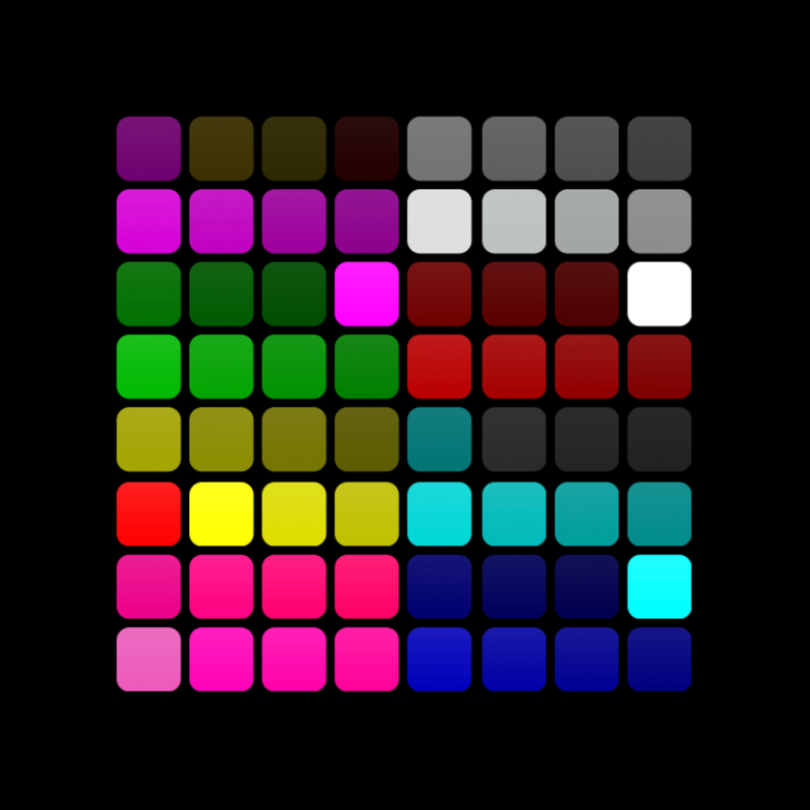
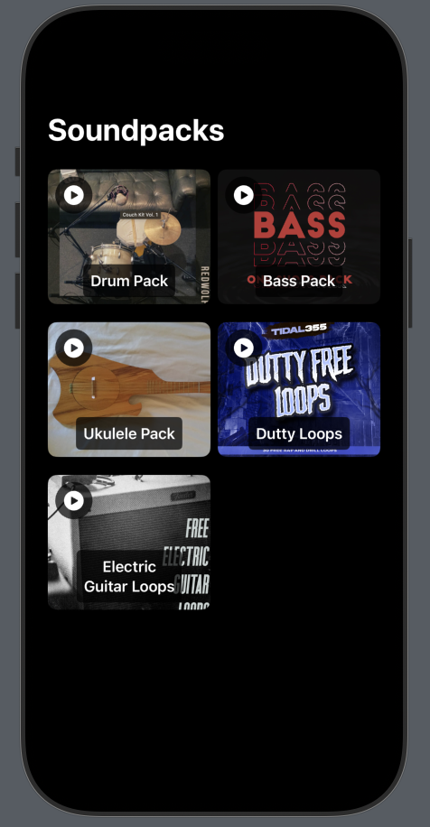
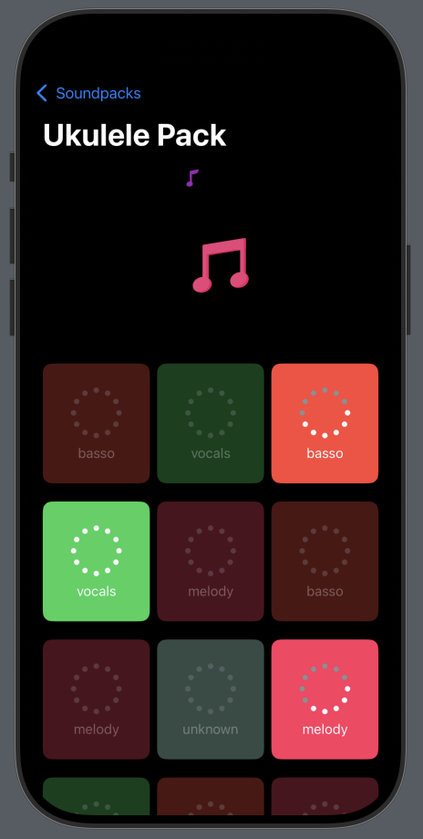

# CrazyPad

# Launchpad - Your Ultimate iPhone Launchpad



Welcome to **Launchpad**, the next-generation app designed to revolutionize your mixing experience.

## 🚀 Features

- **Mix Sounds**: Mix different sounds in background to create your masterpiece.
- **Prebuilt soundpacks**: Let your creativity explode with our PreBuilt soundpacks.

## 📸 Screenshots

| Soundpacks View        | Launchpad View        |
|----------------------------|-----------------------------|
|  |  |

## 🎨 App Demo

[Watch the video walkthrough](https://example.com) to see Launchpad in action!

## 📖 Getting Started

Follow these steps to set up and explore Launchpad:

### Prerequisites

- iOS 15 or later.
- Xcode 13+ (for development).

### Installation

1. Clone the repository:
   ```bash
   git clone https://github.com/jhonnypixel/CrazyPad.git
   ```
2. Navigate to the project directory:
   ```bash
   cd CrazyPad
   ```
3. Open the project in Xcode:
   ```bash
   open CrazyPad.xcodeproj
   ```
4. Build and run on your simulator or device.


## 🛠️ Built With

- **SwiftUI** - Elegant and modern UI framework.
- **AVFoundation** - Powerful framework for audio capabilities.

## 🗺️ Roadmap

- [x] Initial release with basic features.
- [ ] Add high/low-pass filtering.
- [ ] Add custom BPM.
- [ ] Release for iPad and macOS.


## 📝 License

This project is licensed under the MIT License - see the [LICENSE](LICENSE) file for details.

## 📬 Contact

Have questions? Reach out:

- **Email**: [jhonnypixel@gmail.com](mailto:jhonnypixel@gmail.com)
- **GitHub**: [JhonnyPixel](https://github.com/jhonnypixel)

---

Thank you for checking out Launchpad! 🚀 We can't wait to see how you use it to transform your mixing experience!

